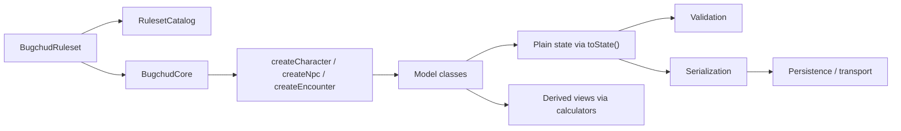

# Data Flow

## What This Is

This page describes how application data moves through the library, from authored ruleset content to editable runtime models and finally to derived views and serialized snapshots.

## When An App Should Use It

Use this page when wiring the package into a UI, persistence layer, import/export flow, or validation pipeline.

## Important Related Types And Classes

- `BugchudCore`
- `RulesetCatalog`
- `CharacterModel`
- `NpcModel`
- `ComputedCombatProfile`
- `ValidationResult`
- `SerializedSnapshot`

## How It Connects To The Rest Of The Library



A typical application lifecycle looks like this:

1. Load a `BugchudRuleset`.
2. Create one shared `BugchudCore` with that ruleset.
3. Use `BugchudCore` to create or rehydrate model instances.
4. Use model methods for edits.
5. Use `views` calculators or model helper methods for display/read models.
6. Validate plain snapshots before saving.
7. Serialize snapshots when they need to cross a storage or network boundary.

## Example Usage

```ts
import { BugchudCore, CharacterModel } from "@bugchud/core";
import { importedRuleset } from "@bugchud/core/data";

const core = new BugchudCore({ ruleset: importedRuleset });

const original = core.createCharacter({ name: "Marta Rust" });
original.addDream(importedRuleset.progression.dreamRefs[0]);

const state = original.toState();
const validation = core.validateCharacter(state);
const payload = original.toJSON();

const reloaded = CharacterModel.fromJSON(core, payload);
```

## Caveats Or Current Limitations

- The ruleset is treated as immutable input data.
- Views are recalculated from state plus ruleset and should not be stored as the canonical source of truth.
- Some edits, especially character progression/body/resource changes, require recomputation of derived state; the model methods handle this for common flows.
