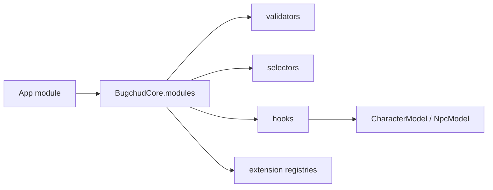

# Extensions

## What This Is

This page explains the supported extension model for downstream applications that need project-specific behavior without forking `@bugchud/core`.

## When An App Should Use It

Use this page when the base schemas are correct, but your application needs additional metadata, selectors, registries, or validation rules.

## Important Related Types And Classes

- `BugchudModule`
- `BugchudCore`
- `ModuleSelectorContext`
- `ExtensionStateMap`
- `ValidationIssue`

## How It Connects To The Rest Of The Library

Modules plug into `BugchudCore` at creation time:



A module may contribute:

- namespaced metadata
- extension registries
- extra validation rules
- selectors invoked through `core.select()`
- hooks that run against new `CharacterModel` and `NpcModel` instances

## Example Usage

```ts
import type { BugchudModule } from "@bugchud/core";

const projectModule: BugchudModule = {
  namespace: "bugchud-characters",
  metadata: {
    feature: "npc-management",
  },
  validators: {
    character: (state) => [],
  },
  selectors: {
    summary: ({ args }) => ({ tag: args[0] }),
  },
};
```

Then mount it:

```ts
const core = new BugchudCore({
  ruleset: importedRuleset,
  modules: [projectModule],
});
```

## Caveats Or Current Limitations

- Modules are namespaced, but they are not isolated sandboxes. Keep naming disciplined.
- Hooks should decorate or extend models, not replace the snapshot boundary design.
- Project-specific runtime data should live in `extensions`, not by mutating canonical base schemas.
