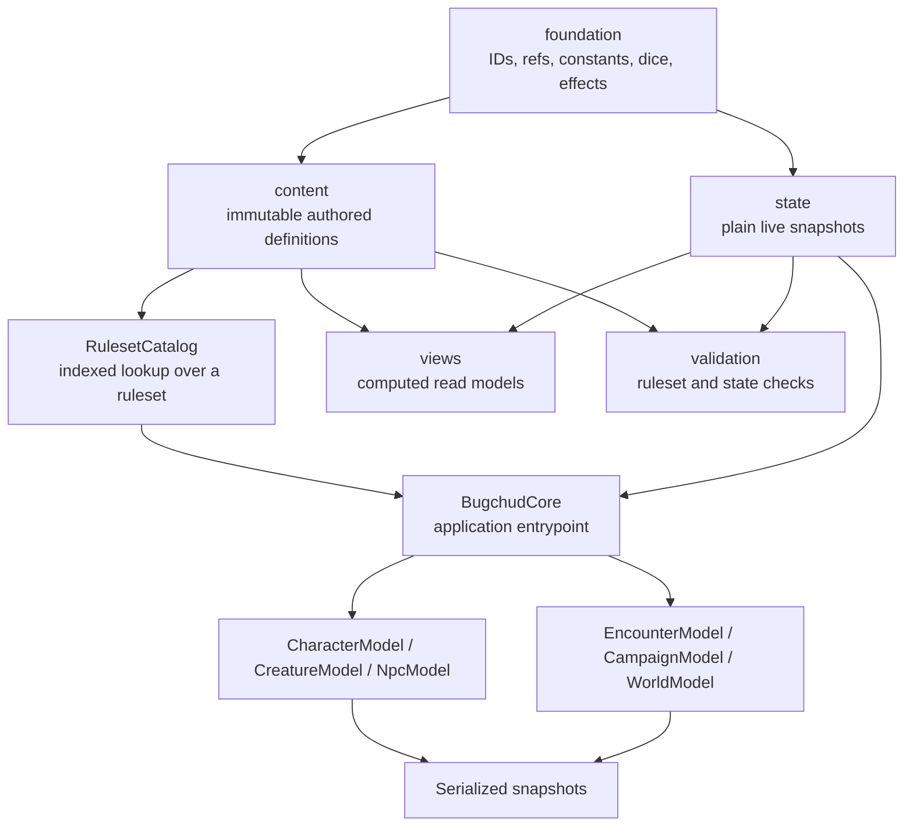

# Layer Model

## What This Is

This page explains the package's layered architecture and why the same library exposes both plain schemas and runtime classes.

## When An App Should Use It

Use this page when you are deciding where a feature belongs, what a UI should read from, or whether application code should depend on `content`, `state`, `views`, or the runtime model layer.

## Important Related Types And Classes

- `BugchudRuleset`
- `RulesetCatalog`
- `CharacterState`
- `CreatureState`
- `CharacterModel`
- `NpcModel`
- `ComputedCombatProfile`
- `SerializedSnapshot`

## How It Connects To The Rest Of The Library



The layers have distinct jobs:

- `foundation`
  Lowest-level vocabulary used everywhere else. This is where ids, refs, tags, dice, and effect shapes come from.
- `content`
  Immutable authored data that belongs to a ruleset. A `RaceDefinition` or `WeaponDefinition` lives here.
- `state`
  Mutable, serializable runtime state. A `CharacterState` or `EncounterState` lives here.
- `contracts`
  Action/event/resolution interfaces for a future simulator or rules engine boundary.
- `views`
  Computed read models that flatten state plus ruleset into UI-friendly shapes.
- `validation`
  Structured checks over rulesets, snapshots, and modules.
- runtime/model layer
  `BugchudCore`, `RulesetCatalog`, and model classes that make application code easier to write.

## Example Usage

```ts
import { BugchudCore } from "@bugchud/core";
import { importedRuleset } from "@bugchud/core/data";

const core = new BugchudCore({ ruleset: importedRuleset });

const character = core.createCharacter({ name: "Selene Ash" });
const draft = character.getCombatProfileDraft();
const snapshot = character.toState();
```

In that example:

- `importedRuleset` is `content`
- `core.catalog` is runtime access over `content`
- `character` is a runtime model over `state`
- `draft` is a `views` projection
- `snapshot` is the plain `state` boundary you persist or transmit

## Caveats Or Current Limitations

- The model layer is intentionally stronger than the simulator layer right now.
- `EncounterModel`, `CampaignModel`, and `WorldModel` are currently thin wrappers over snapshots.
- `contracts` define engine-facing shapes, but the package does not yet implement a full combat or spell resolution engine.
