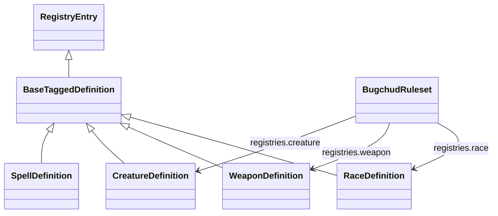

# Content Schemas

## What This Is

This page explains the immutable authored data model in `@bugchud/core/content`.

## When An App Should Use It

Use this page when building ruleset browsers, codex UIs, importers, or systems that need to understand what a ruleset can contain.

## Important Related Types And Classes

- `BugchudRuleset`
- `ContentRegistries`
- `BaseTaggedDefinition`
- `RaceDefinition`
- `WeaponDefinition`
- `CreatureDefinition`
- `WorldDefinition`

## How It Connects To The Rest Of The Library



The content layer is organized into families:

- `character`
  Races, origins, backgrounds, dreams, attributes, progression, lore.
- `body`
  Mutations, bionics, and body rules.
- `inventory`
  Items, weapons, armor, shields, vehicles, mounts, economy.
- `supernatural`
  Grimoires, spells, alchemy, pantheons, patrons, boons, relics.
- `world`
  Factions, regions, cultures, terminology, warbands, fortresses.
- `gm`
  Creatures, NPC loadouts, and GM-facing authored support data.

Shared structure:

- most registries use `BaseTaggedDefinition<K>`
- registries are keyed by branded ids
- relationships are usually expressed through typed refs, not inline copies
- root ruleset sections like `characterCreation` and `coreRules` provide non-registry metadata

## Example Usage

```ts
const race = core.catalog.getRace(character.snapshot.identity.raceRef.id);
const dreams = core.catalog.listByKind("dream");
```

## Caveats Or Current Limitations

- Content definitions are descriptive and authored, not executable rules by themselves.
- Some fields such as formulas and notes describe intent rather than implementing rule evaluation.
- Applications should not mutate shared imported content in place.
