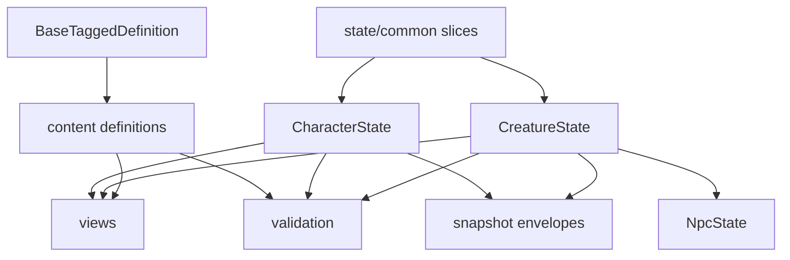

# Schema Overview

## What This Is

This page maps the public schema families and their relationships so application developers can tell which shapes are authored content, which are mutable runtime state, and which are derived outputs.

## When An App Should Use It

Use this page when you need to understand how the public interfaces relate before drilling down into specific schema families.

## Important Related Types And Classes

- `BaseTaggedDefinition`
- `BugchudRuleset`
- `CharacterState`
- `CreatureState`
- `NpcState`
- `ComputedCombatProfile`
- `ValidationIssue`
- `SerializedSnapshot`

## How It Connects To The Rest Of The Library

The public schema families are:

- content schemas
  Immutable authored definitions and the root `BugchudRuleset`.
- runtime state schemas
  Plain mutable snapshots for characters, creatures, encounters, campaigns, and worlds.
- contracts schemas
  Action/event/resolution interfaces intended for simulator boundaries.
- view schemas
  Computed projections derived from content plus state.
- validation schemas
  Structured issue and result types.
- serialization schemas
  Snapshot envelopes that wrap plain state or rulesets for persistence.

## Example Usage

If your app is saving a character, use:

- `CharacterModel` for editing
- `CharacterState` for persistence
- `ValidationResult` for validation output
- `SerializedSnapshot<"character">` for storage or transport

## Caveats Or Current Limitations

- Not every public schema is equally app-facing. Some exist mainly to support future simulation work.
- `NpcState` currently extends `CreatureState` without adding fields, which is an intentional semantic distinction more than a storage divergence.
