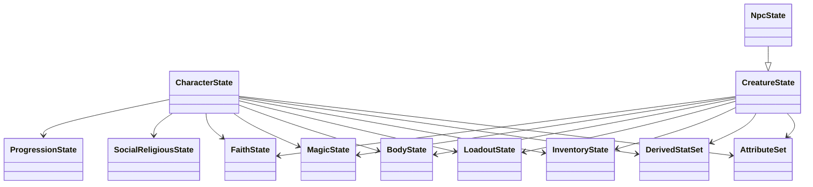

# State Schemas

## What This Is

This page explains the plain runtime snapshot model in `@bugchud/core/state`.

## When An App Should Use It

Use this page when designing persistence, reducers, transport payloads, or editor state that mirrors the library's plain runtime data.

## Important Related Types And Classes

- `CharacterState`
- `CreatureState`
- `NpcState`
- `EncounterState`
- `CampaignState`
- `WorldState`
- `AttributeSet`
- `InventoryState`
- `ProgressionState`

## How It Connects To The Rest Of The Library



The main state families are:

- `state/common`
  Shared slices reused by characters, creatures, encounters, and campaigns.
- `state/character`
  `CharacterIdentityState`, `CharacterState`, `CreatureIdentityState`, `CreatureState`, `NpcState`.
- `state/encounter`
  Encounter actors, zones, ambush state, turn state, encounter root snapshot.
- `state/campaign`
  Vehicles, warbands, fortresses, campaign clocks, territories, campaign root snapshot.
- `state/world`
  Global world conditions such as active weather.

Key relationship notes:

- `CharacterState` is the player-character snapshot.
- `CreatureState` is the shared non-player creature snapshot.
- `NpcState` extends `CreatureState` for semantic clarity, even though it does not currently add fields.
- shared slices from `state/common` keep concepts like inventory, body, magic, faith, and resources consistent across runtime entities.

## Example Usage

```ts
const snapshot = character.toState();
await saveCharacter(snapshot);
```

## Caveats Or Current Limitations

- Some wrapper classes are richer than their plain snapshots; do not expect plain state alone to supply helper behavior.
- Derived values may need recomputation after edits if you bypass the model layer.
- `kind` discriminators matter for validation and serialization and should not be changed casually.
