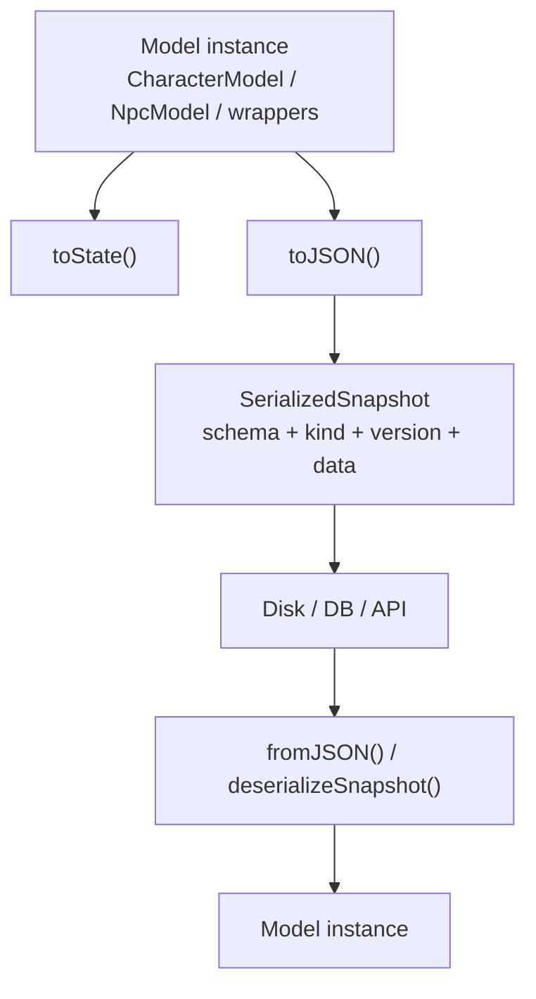

# Snapshots And Serialization

## What This Is

This page explains the boundary between editable model classes and the plain snapshots that belong in storage, transport, and long-term persistence.

## When An App Should Use It

Use this page when saving data, loading data, syncing over a network, or defining app-level persistence contracts.

## Important Related Types And Classes

- `CharacterState`
- `CreatureState`
- `EncounterState`
- `CampaignState`
- `WorldState`
- `SerializedSnapshot`
- `serializeSnapshot()`
- `deserializeSnapshot()`

## How It Connects To The Rest Of The Library



The design rule is simple:

- classes are for editing and ergonomics
- plain state is for persistence

This keeps the library friendly to React state, JSON storage, import/export pipelines, and future migrations.

It also means long-lived bodily consequences belong in snapshots. Aggregate wound totals, explicit missing limbs, prosthetic replacements, and mutation-added body parts should all serialize as normal runtime state rather than being reconstructed from UI-only flags.

## Example Usage

```ts
const payload = character.toJSON();

// later
const loaded = CharacterModel.fromJSON(core, payload);
```

If your app does not need the class API after load, you can deserialize directly to state:

```ts
import { deserializeSnapshot } from "@bugchud/core";

const state = deserializeSnapshot("character", payload);
```

## Caveats Or Current Limitations

- Snapshot envelopes are versioned, but there is not yet a full migration framework between versions.
- `toJSON()` returns a structured object envelope, not a string. Stringify it yourself if your storage layer expects raw JSON text.
- The envelope validates schema id, kind, and version, but semantic correctness still belongs to the validation helpers.
- Explicit anatomy state now survives serialization, but migration stories for older saved snapshots that predate `body.anatomy` are still an app-level concern until a broader migration framework exists.
