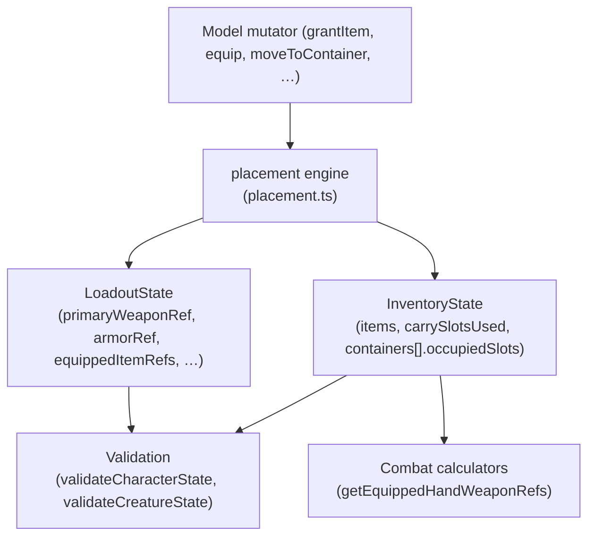

# Inventory Placement

## What This Is

This guide explains how `@bugchud/core` tracks physical item placement inside
inventories. It covers the three placement states a stack can occupy (loose,
contained, equipped), the rules for core combat slots, how carry and container
math work, how loadout fields stay synchronized, and how legacy snapshots are
handled on load.

## When An App Should Use It

Use this guide when building inventory UIs, loadout editors, loot grant flows,
container management screens, or any feature that reads or writes
`InventoryState`, `LoadoutState`, or the inventory mutator methods on
`CharacterModel`, `CreatureModel`, or `NpcModel`.

## Important Related Types And Classes

- `OwnedItemStack` — one owned stack with optional placement fields
- `EquippedCoreCombatSlot` — union of valid combat slot names
- `InventoryState` — full inventory snapshot including carry and container data
- `LoadoutState` — projected equipped state derived from inventory stacks
- `InventoryContainerState` — a single container instance inside an inventory
- `CharacterModel` / `CreatureModel` / `NpcModel` — runtime models with inventory mutators
- `normalizeInventoryPlacementState()` — shared placement engine entry point

## How It Connects To The Rest Of The Library



Every model mutator delegates to the shared placement engine.
`carrySlotsUsed`, container `occupiedSlots`, and all `LoadoutState` fields are
recomputed by the engine after each call — callers never maintain them manually.
Validation and combat calculators read from the same normalized snapshot.

## The Placement Model

Every `OwnedItemStack` has exactly one placement at a time:

| Placement | Condition | Carry cost |
|-----------|-----------|-----------|
| **Loose** | Neither `containerId` nor `equippedSlot` is set | Consumes base carry slots |
| **Contained** | `containerId` is set | Consumes container capacity; free for base carry |
| **Equipped** | `equippedSlot` is set | Free for both base carry and container capacity |

Both `containerId` and `equippedSlot` must not be set on the same stack.

Stacks with the same `ref` but different placements are kept as separate entries
and do not merge. Two loose stacks of the same ref *do* merge (and so do two
contained stacks in the same container).

### Carry math

`carrySlotsUsed` = sum of `slotCost.slots × quantity` for **loose stacks only**.
Equipping gear removes its carry cost; stowing it back to loose restores it.
The container item itself (the bag, pouch, etc.) costs its authored carry slots;
the items inside it are free for base carry and instead consume the container's
`capacity`.

## Core Combat Slots

The four slots that can hold physically equipped gear:

| Slot | Accepts | Constraint |
|------|---------|-----------|
| `mainHand` | One-handed weapon or shield | Cannot be occupied while `twoHanded` is active |
| `offHand` | One-handed weapon or shield | Cannot be occupied while `twoHanded` is active |
| `twoHanded` | Two-handed weapon only | Both `mainHand` and `offHand` must be free |
| `armor` | Armor only | Only one armor stack at a time |

Additional invariants:
- An equipped stack always has `quantity: 1`.
- No auto-swap or auto-unequip. Methods throw rather than silently displacing gear.
- Shields and one-handed weapons are interchangeable in hand slots — a shield
  takes a hand the same way a weapon does.

## Loadout Projection

After every mutation the placement engine reprojects `LoadoutState` from the
current equipped stacks:

- `primaryWeaponRef` — twoHanded weapon, else mainHand weapon, else offHand weapon
- `secondaryWeaponRef` — the offHand weapon only when *both* hands hold one-handed weapons
- `shieldRef` — equipped shield (mainHand checked before offHand)
- `armorRef` — equipped armor
- `equippedItemRefs` — combat slot refs in slot order (mainHand → offHand →
  twoHanded → armor) followed by legacy non-combat refs (grimoires, relics)

Do not write `primaryWeaponRef`, `armorRef`, `shieldRef`, or `secondaryWeaponRef`
directly. They will be overwritten on the next normalization pass.

## Legacy Snapshot Normalization

Snapshots created before the placement engine existed may have loadout refs
(`primaryWeaponRef`, `armorRef`, etc.) but no equipped stacks
(`equippedSlot` unset on all items). On load — via `CharacterModel.fromState()`,
`CharacterModel.fromJSON()`, or the NPC equivalents — the engine automatically
converts those refs into equipped stacks by splitting matching loose stacks.

Conversion skips a desired slot if the slot is already occupied or if no owned
loose stack of the ref exists. An invalid legacy ref (loadout ref with no
matching owned stack) is left as a validation error, not invented as free gear.
Snapshots that already have equipped stacks are left as-is (conversion is a
one-shot upgrade, not a repeated rewrite).

## Legacy Non-Combat Items (Grimoires And Relics)

Grimoires and relics are not physicalised into combat slots in this pass.
They stay in `loadout.equippedItemRefs` as legacy entries. Use `equip()` /
`unequip()` on the model, or `setLegacyNonCombatEquipped()` directly, to toggle
their equipped state. Strict slot rules do not apply to them.

## Example Usage

### Grant and equip a weapon

```ts
const sword: OwnedItemStack = { ref: { kind: "weapon", id: "longsword" }, quantity: 1 };

character
  .grantItem(sword)          // adds a loose stack
  .equipToMainHand(sword.ref); // moves it from loose to mainHand
```

After `equipToMainHand`, `carrySlotsUsed` decreases by the longsword's authored
`slotCost.slots` and `loadout.primaryWeaponRef` is set automatically.

### Dual-wield two one-handed weapons

```ts
// Must own at least 2 copies before equipping the second
character
  .grantItem({ ref: daggerRef, quantity: 2 })
  .equipToMainHand(daggerRef)
  .equipToOffHand(daggerRef);
```

### Two-handed weapon

```ts
// Both hands must be free
character
  .unequipFromMainHand()        // if occupied
  .unequipFromOffHand()         // if occupied
  .equipTwoHanded(greatswordRef);
```

### Equip armor and a shield

```ts
character
  .equipArmor(chainmailRef)
  .equipToOffHand(bucklerRef);
```

### Unequip by slot

```ts
character
  .unequipFromMainHand()
  .unequipFromOffHand()
  .unequipArmor();
```

### Stow equipped gear back to loose

```ts
// stowEquipped works by ref, consuming equipped slots in order
character.stowEquipped(daggerRef);
```

### Container operations

```ts
// Move 3 torches from loose inventory into a belt pouch
character.moveToContainer(torchRef, 3, "beltPouch");

// Retrieve 1 torch back to loose inventory
character.removeFromContainer(torchRef, 1, "beltPouch");
```

After `moveToContainer`, `carrySlotsUsed` decreases and the pouch's
`occupiedSlots` increases by `torch.slotCost.slots × 3`.

### Legacy normalization on load

```ts
// A snapshot saved before the placement engine exists with primaryWeaponRef
// set but no equipped stacks. The model constructor normalizes it automatically.
const model = CharacterModel.fromState(core, legacySnapshot);
// model.snapshot.inventory.items now has a stack with equippedSlot: "mainHand"
// model.snapshot.loadout.primaryWeaponRef still points to the same weapon
```

## Caveats And Current Limitations

- Container creation and removal is not part of the placement API in this pass.
  `moveToContainer` and `removeFromContainer` only operate on containers that
  already exist in `inventory.containers`.
- Nested containers are rejected. An item whose authored `itemKind` is
  `"container"` cannot be placed inside another container.
- Grimoires and relics do not consume carry slots and are not placed into
  physical slots yet. A future worn-slot pass will physicalise them.
- Equip methods are strict — they throw on slot conflicts rather than displacing
  existing gear. If you need to swap weapons, explicitly unequip first.
