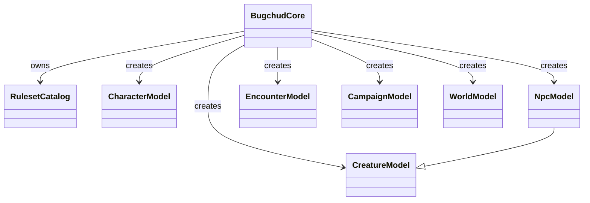

# Runtime API Guide

## What This Is

This guide explains the application-facing runtime layer: `BugchudCore`, `RulesetCatalog`, model classes, thin wrappers, factories, serialization helpers, and validation helpers.

## When An App Should Use It

Use this guide when you want to know what the root package exports are for and how they fit together in day-to-day application code.

## Important Related Types And Classes

- `BugchudCore`
- `RulesetCatalog`
- `CharacterModel`
- `CreatureModel`
- `NpcModel`
- `EncounterModel`
- `CampaignModel`
- `WorldModel`
- `serializeSnapshot()`
- `deserializeSnapshot()`
- `normalizeInventoryPlacementState()` / `InventoryPlacementState`

## How It Connects To The Rest Of The Library



Runtime surface summary:

- `BugchudCore`
  Main app entrypoint. Owns the ruleset, catalog, modules, validation helpers, and model factories.
- `RulesetCatalog`
  Indexed lookup layer over the immutable ruleset.
- `CharacterModel`
  Editing API over `CharacterState`. All inventory mutators delegate to the
  shared placement engine so carry math and loadout projections stay
  synchronized automatically. The model also exposes explicit body-state
  mutators for aggregate wounds and core/additional anatomy changes.
- `CreatureModel`
  Base editing API over `CreatureState`. Shares the same inventory placement
  engine as `CharacterModel` and now exposes the same explicit anatomy editing
  surface.
- `NpcModel`
  `CreatureModel` plus NPC-specific module hook behavior.
- wrappers
  `EncounterModel`, `CampaignModel`, and `WorldModel` are thin convenience wrappers over plain snapshots.
- factories
  `createCharacterState`, `createNpcState`, `createEncounterState`, and related helpers produce plain snapshots directly.
- serialization
  `serializeSnapshot` and `deserializeSnapshot` wrap or unwrap plain state with schema metadata.
- validation
  `core.validate*()` and low-level validators produce structured `ValidationResult` objects.

## Example Usage

```ts
const core = new BugchudCore({ ruleset: importedRuleset });

const character = core.createCharacter({ name: "Selene Ash" });
const npc = core.createNpc({ name: "Roadfang", allegiance: "Raiders" });
const encounter = core.createEncounter({ label: "Road Ambush" });

const race = core.getRace(character.snapshot.identity.raceRef.id);
const options = core.catalog.getCreationOptions({
  originRef: character.snapshot.identity.originRef,
});

character.patchBodyPart("leftArm", {
  status: "prosthetic",
  notes: ["Field-fitted scrap prosthetic."],
});
```

For body-state editing, the most important methods are:

- `setWounds(current, maximum?)`
  Update aggregate wound totals.
- `patchBodyPart(location, patch)`
  Update one core body part in `body.anatomy.core`.
- `upsertAdditionalBodyPart(part)`
  Add or replace one mutation-driven or prosthetic extra part in `body.anatomy.additionalParts`.
- `removeAdditionalBodyPart(id)`
  Remove an extra tracked body part by id.

## Caveats Or Current Limitations

- The root package is focused on creation/edit/validation flows more than full simulation flows.
- Model classes are ergonomic wrappers, not a replacement for plain state persistence.
- Thin wrappers around campaign/world/encounter snapshots intentionally expose a smaller API today than character and NPC models.
- The runtime API can now persist explicit amputations, replacements, and extra body parts, but those records do not yet imply built-in combat mechanics on their own.
