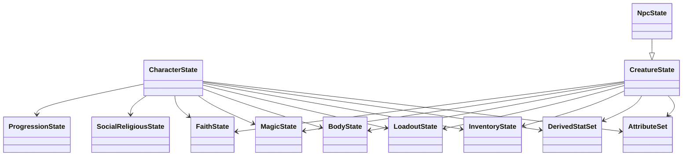

# State Schemas

## What This Is

This page explains the plain runtime snapshot model in `@bugchud/core/state`.

## When An App Should Use It

Use this page when designing persistence, reducers, transport payloads, or editor state that mirrors the library's plain runtime data.

## Important Related Types And Classes

- `CharacterState`
- `CreatureState`
- `NpcState`
- `EncounterState`
- `CampaignState`
- `WorldState`
- `AttributeSet`
- `InventoryState`
- `ProgressionState`
- `BodyState`
- `InjuryState`
- `AnatomyState`
- `BodyPartState`

## How It Connects To The Rest Of The Library



The main state families are:

- `state/common`
  Shared slices reused by characters, creatures, encounters, and campaigns.
- `state/character`
  `CharacterIdentityState`, `CharacterState`, `CreatureIdentityState`, `CreatureState`, `NpcState`.
- `state/encounter`
  Encounter actors, zones, ambush state, turn state, encounter root snapshot.
- `state/campaign`
  Vehicles, warbands, fortresses, campaign clocks, territories, campaign root snapshot.
- `state/world`
  Global world conditions such as active weather.

Key relationship notes:

- `CharacterState` is the player-character snapshot.
- `CreatureState` is the shared non-player creature snapshot.
- `NpcState` extends `CreatureState` for semantic clarity, even though it does not currently add fields.
- shared slices from `state/common` keep concepts like inventory, body, magic, faith, and resources consistent across runtime entities.
- `BodyState` now holds both aggregate injury totals and explicit anatomy details.

## Example Usage

```ts
const snapshot = character.toState();
await saveCharacter(snapshot);
```

Example body slice:

```ts
{
  injuries: {
    currentWounds: 3,
    maximumWounds: 12,
    deathPressure: 0,
  },
  anatomy: {
    core: {
      head: { id: "head", label: "Head", kind: "head", status: "intact", woundCount: 0 },
      torso: { id: "torso", label: "Torso", kind: "torso", status: "intact", woundCount: 1 },
      rightArm: { id: "rightArm", label: "Right Arm", kind: "arm", status: "intact", woundCount: 0 },
      leftArm: { id: "leftArm", label: "Left Arm", kind: "arm", status: "lost", woundCount: 2 },
      rightLeg: { id: "rightLeg", label: "Right Leg", kind: "leg", status: "intact", woundCount: 0 },
      leftLeg: { id: "leftLeg", label: "Left Leg", kind: "leg", status: "impaired", woundCount: 0 },
    },
    additionalParts: [],
  },
  xom: { current: 0, permanent: 0, thresholdsCrossed: [] },
  mutationRefs: [],
  bionicRefs: [],
  activeConditions: [],
}
```

## Body Slice

`BodyState` now separates broad injury accounting from explicit anatomy persistence:

- `InjuryState`
  Tracks cumulative wound totals, maximum wounds, death pressure, and healing tags.
- `AnatomyState`
  Tracks concrete body-part records for the normal humanoid layout plus extra parts.

`AnatomyState.core` always contains:

- `head`
- `torso`
- `rightArm`
- `leftArm`
- `rightLeg`
- `leftLeg`

Each `BodyPartState` records:

- stable `id`
- readable `label`
- broad `kind`
- explicit `status`
- optional per-part `woundCount`
- optional notes and tags

Use this when an application needs to persist facts like:

- a limb being torn off
- a torso injury that should survive save/load
- a prosthetic replacement
- an added mutation limb, tail, wing, or graft

Extra parts live in `AnatomyState.additionalParts` so mutation-heavy or custom downstream apps do not need to overload the six core slots.

## Caveats Or Current Limitations

- Some wrapper classes are richer than their plain snapshots; do not expect plain state alone to supply helper behavior.
- Derived values may need recomputation after edits if you bypass the model layer.
- `kind` discriminators matter for validation and serialization and should not be changed casually.
- Explicit anatomy state is persistence-oriented. It records what happened to the body, but it does not yet by itself enforce combat penalties, healing rules, or amputation logic.
